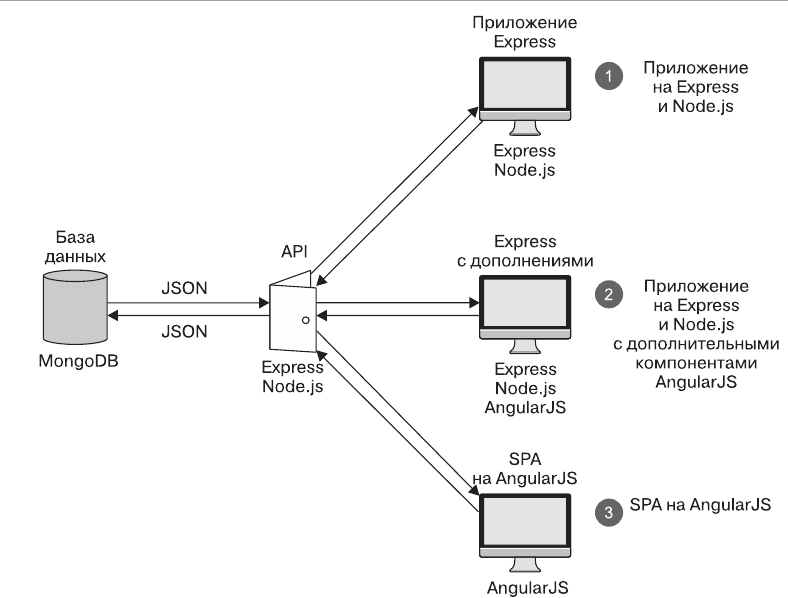

# Loc8r

## Versions of favicon

_v1=_  __->__
_v2=_  __->__
_v3=_ 

## Архитектура приложения



## Нерешённые проблемы

1. **Проблема с сигналами.** Из-за недоработанной обработки сигналов сервер закрывается не польностью и продолжает занимать отведённый порт и дальше.
2. **geoNear().** Книге 2015 год. Многие вещи устарели, особенно эта функция. Одно из её решений у меня сработало на половину. Требуется дальнейшее разбирательство.

## Layout


## Routes


## API REST

### ALL URL


### GET


### POST


### PUT


### DELETE


## Learnway 7

1. Установка модуля **request**:

    ```shell
        npm install --save request
    ```

2. В файле __app_server/controllers__:

    ```javascript
        var request = require('request');
    ```
